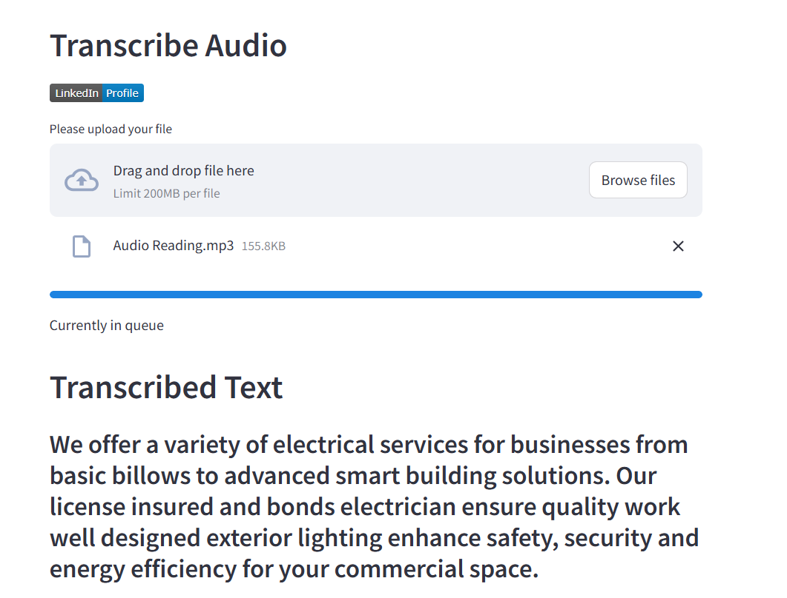

# 🎧 Transcript Audio



Transcribe audio files effortlessly using our Streamlit app. Upload your audio files and get the transcriptions in no time!

## 🚀 Features

- **Easy File Upload**: Upload your audio files directly through the app.
- **Real-time Progress**: Track the transcription progress with a progress bar.
- **Instant Results**: Get your transcriptions displayed instantly once processed.

## 🛠️ Installation

1. Clone the repository:
    ```sh
    git clone https://github.com/Yesner/transcript_audio.git
    ```
2. Navigate to the project directory:
    ```sh
    cd transcript_audio
    ```
3. Install the dependencies:
    ```sh
    pip install -r requirements.txt
    ```

## 📦 Usage

1. Run the Streamlit app:
    ```sh
    streamlit run main.py
    ```
2. Open your browser and go to `http://localhost:8501`.
3. Upload your audio file and wait for the transcription.

## 📄 License

This project is licensed under the MIT License - see the LICENSE file for details.

## 👤 Author

- **Yesner Salgado** - [LinkedIn](https://www.linkedin.com/in/yesner-salgado/)

---

Feel free to contribute to this project by submitting issues or pull requests.
